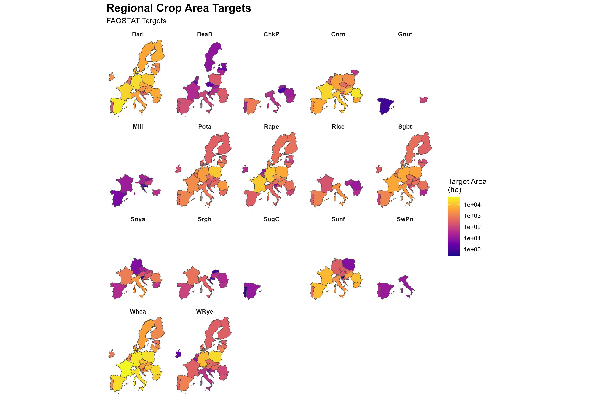
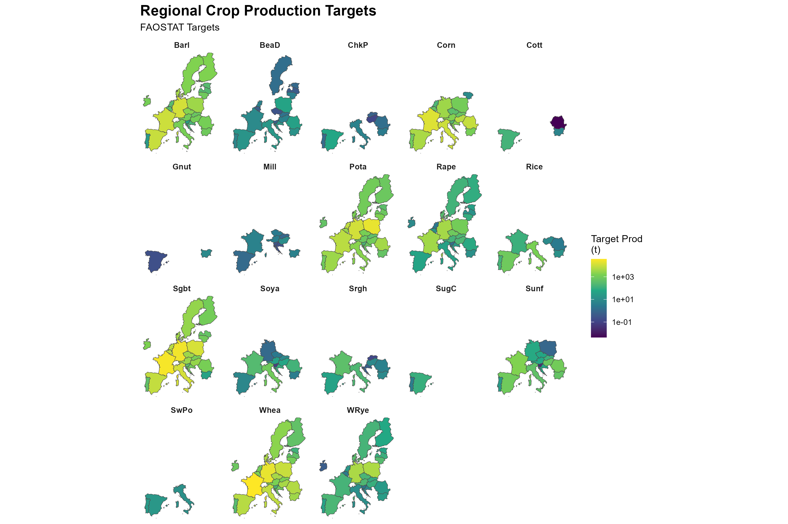

# Crop Distribution Downscaling System (CDDS)

**Title: Downscaled crop and management intensity map for the EU**

## Abstract
Agricultural land use and management have profound impacts on natural resources such as soils, biodiversity, and air quality. Modeling the long-term effects of anthropogenic activities on these resources requires a comprehensive understanding of crop distribution, cultivation intensity, and the associated management practices. 

This repository contains the Crop Distribution Downscaling System (CDDS), an R-based pipeline designed to downscale crop area and production targets to a high-resolution 1 km² EEA reference grid. We present a spatially explicit crop and intensity map that integrates crop distribution with management intensity on Corine land-cover (CLC) data. The produced maps are calibrated to meet utilized agricultural area (UAA) and production targets from GLOBIOM and historical FAO statistics, using bias correction methods as well as an updating routine to adjust energy intensity levels based on a biophysical yield model (EPIC-IIASA). The approach resolves major crop types at 5 input intensity classes at a 1 km resolution.

## 1. Introduction
Reducing the adverse environmental impacts of agriculture while improving resource management remains a crucial challenge for policymakers in the European Union. Effective environmental policies increasingly rely on ex-ante simulations that model the complex interactions between agricultural practices and the environment.

One critical aspect of these interactions is the intensity of agricultural inputs, particularly nitrogen fertilizers and intensive management practices. While high-input farming enhances short-term productivity, it has long-term negative consequences for multiple ecosystems. The environmental consequences of agriculture are highly dependent on local landscape characteristics, making spatial explicitness a critical factor in assessing impacts.

In this repository, we propose a crop and intensity mapping and harmonization approach designed for both ex-post and ex-ante modeling applications. Our method generates spatially explicit maps of crop distribution and management intensity, integrating probabilistic crop type estimates with agricultural statistics targets and high-resolution land-use data.

### Input Targets Visualization

The following maps illustrate the top-level agricultural statistics targets used to calibrate the downscaling pipeline. These targets, derived from historical FAO statistics or GLOBIOM baselines, define the total area and production constraints that the high-resolution crop allocations must meet at the national and regional level.

**Regional Crop Area Targets (ha):**
This plot visualizes the spatial distribution of target utilized agricultural area per crop across EU member states. It highlights regional concentrations, such as dense wheat areas in Western Europe and sunflower cultivation in Eastern Europe.

**Regional Crop Production Targets (t):**
Corresponding production targets are visualized below. Differences in the spatial patterns between area and production emphasize the variability in regional crop yields.

*(These plots were generated using the standalone `plot_targets.R` script, which aggregates regional statistics from the CDDS configuration).*

## 2. Data

This pipeline integrates several spatial and statistical datasets to generate consistent maps:

### Land Use and Management (LUM) Data
The foundation of our analysis is the Land Use and Management map (LAMASUS geodatabase), derived from the CORINE Land Cover (CLC) database. It differentiates between arable and permanent cropland and assesses management intensity using an irrigation layer and an energy input layer. Five arable intensity classes are utilized (LUM1 to LUM5), corresponding to very low to very high intensity.

### Crop Distribution Probabilities
We employ probabilistic crop maps that provide stochastic information about the prevalence of different crops at a 1 km² resolution. These are derived from satellite imagery, ground observations, climate data, and soil characteristics.

### Management-specific Yield and Emission Data (EPIC-IIASA)
A regional biophysical modeling framework (EPIC-IIASA) provides simulated yield and carbon variables specifically for the LUM classes. It simulates five incrementally increasing fertilization intensities for each crop and spatial simulation unit (SimU). These simulations are mapped to the respective LUM classes (e.g., LUM1 = low intensity rainfed, LUM5 = high intensity irrigated/rainfed).

## 3. Methodology & Code Workflow

The routine is executed per year $t$ and per region $j$. The main entry point for local execution is `main.R`. When `CLUSTER = FALSE` in `user_config.R`, the pipeline iterates locally over the regions and years specified in `clustergrid` via a sequential chain of 7 scripts.

### 3.1 Initialization and Unharmonized Data
In the first step, land-use information from the LUM geodatabase is aggregated to the EEA 1 km² pixel level to define the crop production areas. The crop probabilities are applied to the given arable areas, yielding an initial, unharmonized distribution.

* `0_initialize_routine.R`: Sets up the environment, determining file paths and loading required geographic boundaries and mappings.
* `1_prepare_startmap_Linda_LUM.R`: Prepares the starting agricultural areas using the 100m LUM raster overlaid on the 1km² EEA grid.
* `2_prepare_priors_Storm.R`: Generates prior crop probabilities per grid cell based on multi-band suitability rasters.
* `3_load_EPIC.R`: Loads and joins spatial EPIC crop yield data, mapping EPIC simulation points to the EEA grid.

### 3.2 Harmonization of Area
The utilized agricultural area for each crop is adjusted so that the sum across all cells within a region matches the target agricultural area. A bias correction approach is applied, proportionally adjusting the prior probabilities to ensure the total allocated area aligns with the regional total. 

* `4_prepare_targets.R`: Prepares the top-level area and production targets. This dynamically toggles between **GLOBIOM** (`croptargets_GLOBIOM.rds`) and historical **FAO** (`faostat_avg_1998_2002.rds`) targets. 
* `5_area_matching.R`: The core spatial allocation engine. It uses the `downscalr` package to distribute the regional targets into the 1km² crop area using the adjusted priors as weights.

### 3.3 Harmonization of Production
Having harmonized the areas for all crops, these areas are combined with input intensity levels from the LUM geodatabase and pixel-specific yield data from EPIC-IIASA. Harmonization is achieved by intelligently shifting crop areas between different management intensity levels (LUM classes `M1.rf` to `M5.rf`) where yields differ, running iterative redistributions until production targets are met.

* `6_production_matching.R`: Refines the area allocation to meet production targets by shifting crop areas between management intensity levels.

## 4. Results

After the sequence completes, `main.R` packages the outputs (`final.alloc`, `show.res`, `result`) and saves them as `.rds` files into the `output/res_v1/` directory for the specific region and year. The harmonized area and production maps reflect the spatial distribution of cultivation and the impact of yield variations.

> [!NOTE] 
> **Input Information Needed:** Final Output Visualizations 
> To generate the final output maps (e.g., Wheat area and production in specific countries or regions as referenced in the paper), run the post-processing and aggregation scripts:
> * `7_summarise_CDDS.R`
> * `8_aggreg_res_SIMU_LU_grid.R`
> 
> *Once aggregated, plot the results to show the spatial heterogeneity of crop allocations.*
> 
> `[Insert plots of harmonized crop area here]`
> `[Insert plots of harmonized crop production here]`
